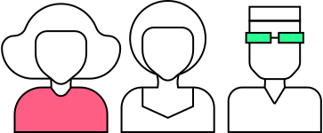

# Proyecto: Réplica Web [https://openeu.eu] 🚀

## Descripción 📝

Este proyecto es una réplica de la página de OpenEU, enfocando la atención en las animaciones.

#### Tecnologías usadas:

HTML5
CSS3
JavaScript (ES6)

## Estilos css generales del proyecto:

**IMPORTANTE**: Los elementos tienen aplicadas algunas clases adicionales además de las necesarias para las animaciones (para tamaños de texto, posiciones, etc.). Si deseas reutilizar esas clases, debes copiarlas junto con los elementos, del mismo modo que lo harías al copiar las clases para las animaciones.

Ten en cuenta también las media queries para asegurarte de que el diseño sea responsive y se adapte a diferentes tamaños de pantalla.

## Animaciones del proyecto:

### `section-hero`

#### 1. Componente `.section-hero-tittle` (título animado)

Este componente contiene animacion para que el texto aparezca desplazandose y otra para que los bordes tambien aparezcan animados.

##### Ejemplo:

```html
<div class="section-hero-tittle">
  <div class="hero-title-border-animation">
    <h1 class="hero-title-primary">OpenEU</h1>
  </div>
  <div class="hero-title-border-animation">
    <h2 class="hero-title-secondary">The Open European University</h2>
  </div>
</div>
```

##### Uso:

1. Agrega el componente `.section-hero-tittle`.
2. Aplica en tu CSS sus clases correspondientes.
3. Agrega el script para la animación del título (`section-hero-tittle`).

- Este componente también funcionará con un solo elemento de texto:

```html
<div class="section-hero-tittle">
  <div class="hero-title-border-animation">
    <h1 class="hero-title-primary">OpenEU</h1>
  </div>
</div>
```

En este caso, no es necesario agregar la función de JavaScript.

#### 2. Componente `.hero-scroll-animation` (scroll animado)

Este componente incluye una animación para que el texto aparezca y otra animación para un efecto de rebote continuo.

**IMPORTANTE**: Este componente tiene un retraso de 2 segundos para que, en este diseño, aparezca después de que termine la animación del título. Si deseas utilizarlo en otro proyecto, puedes eliminar esa propiedad en la clase `.scroll-animation-span`.

##### Ejemplo:

```html
<div class="hero-scroll-animation">
  <span>scroll<br /></span>
</div>
```

##### Uso:

1. Agrega el componente `.hero-scroll-animation`.
2. Aplica en tu CSS las clases necesarias.

### `section-mission` y `section-numbers`

#### Animación `slide-in-animation`

Esta animación se aplica a elementos de texto para que **aparezcan con un desplazamiento suave** desde abajo hacia su posición original.

Además, incluye un script en JavaScript para activar la animación solo cuando el elemento sea visible en la pantalla (viewport).
_Esta animación se utiliza en diferentes elementos del DOM_.

##### Ejemplos:

```html
<div class="slide-in-animation">
  <h1>Título animado</h1>
</div>
```

```html
<div class="slide-in-animation">
  
</div>
```

##### Uso:

1. Aplica la clase `slide-in-animation` a un contenedor que contenga un elemento de texto ( parrafo, headding...).
2. Aplica el script slide-in-animation con la funcion initSlideInOnViewport(), esta es la que se encarga de activar la animacion cuando el elemento aparezca en pantalla.

### `section-numbers`

#### Componente `section-numbers` > article (artículo con números animados)

Este componente incluye una animación para la imagen y otra animación para los números.

##### Ejemplos:

```html
<article class="section-article-card section-border">
  <div class="slide-in-animation">
    
  </div>
  <p class="h5">+<span class="counter">368,000</span></p>
  <p class="h2">Number of students</p>
  <p class="h2">Academic year: 2022/2023</p>
</article>
```

##### Uso:

1. **Animación de la imagen**: Aplica la clase `slide-in-animation`, como en los ejemplos anteriores, junto con los scripts correspondientes.
2. **Animación de los números**: Esta animación depende únicamente de JavaScript, por lo tanto, solo es necesario aplicar el script de la animación para `section-numbers` > article > (.counter).
